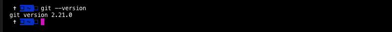
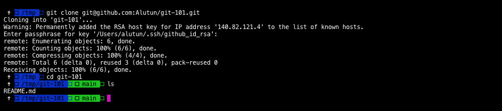

# GIT-101 by Alexis LUTUN

First Introduction to GIT && hands on the basics !

This class will start with an introduction lecture on GIT, it will be then follow by two workshops.

### Prerequisite

_Before doing that class, make sure you are ready and that the following are true_.

- [ ] You have a Github Account.
- [ ] You [installed git](https://git-scm.com/book/en/v2/Getting-Started-Installing-Git/) or [Github desktop](https://desktop.github.com/). Make sure it's working by running the following command in your terminal  :

  ``` git --version ```  



- [ ] You cloned clone this repository using GIT CLI before the class.

  ``` git clone https://github.com/Alutun/git-101.git ```



- **You are Ready !  :rocket:**


## 2. :blue_book: - LECTURE

_The class will start by a lecture and cover the What, Why of GIT and prepare us for the two workshops_

[WIP]

## 3. :gear: - WORKSHOP - HANDS ON DECK !

### 3.1 :sand:  Sandbox - Let's try !

_Let's try some basic command in a sandbox environment and visually see how git works and behave_/

[WIP]

### 3.2 Let's try write a book together !

_Now that we master the basics command, let's try to collaborate together on one repositories as we would do during a real project_

[WIP]

## 4.GOING FURTHER

_You finished the class, but you want to lear more, this section is for you :mag:_

### Ressources

#### :bookmark_tabs: - CheatSheet

Get all the your basic git commands in one [PDF.](./Ressources/git-cheat-sheet.pdf)
_Thanks to [Simon MAPLE](https://www.jrebel.com/blog/git-cheat-sheet)_

#### :green_book: - Book

Once you get familiar with the basics, you dig deeper with the official books written by **Scott Chacon and Ben Straub**
- Get your [english copy here](https://git-scm.com/book/en/v2)
- Aussi disponible en [Français ici](https://git-scm.com/book/fr/v2)
