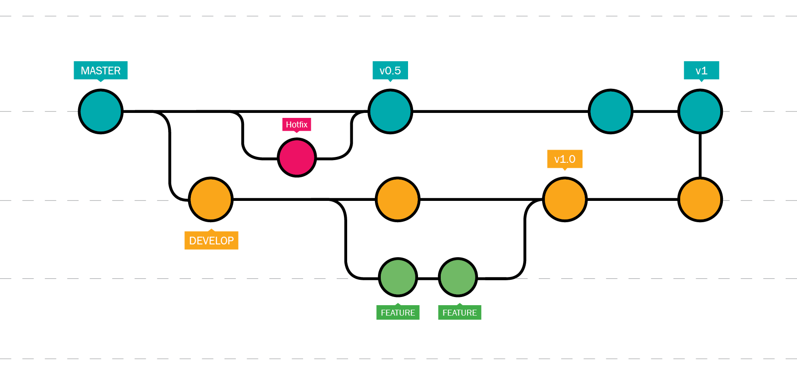

autoscale: true


# GIT - 101

---

#70%


---

### 100 Millions :file_folder: 2018
# X2in2
### 200 Millions :file_folder: 2020

---

#40 Millions :man::woman:


---


#  Alexis LUTUN

<br>

### Full Stack developper
### Cloud Architect (AWS/GCP)
### Lover of GITLAB/HUB CI


> I love crafting software solutions in the cloud to connect the world

---

# Who What Where When How

<br>


---

## **Who** What Where When How


---


## Who **What** Where When How


- Open source
- Version Control System
- Distributed
- designed for speed and efficiency


---

### [fit] **What** : Version Control System

> A version control system tracks the history of changes on __shared__ projects.

Contributors can review project history to find out:

- Which changes were made?
- Who made the changes?
- When were the changes made?
- Why were changes needed?


---

### [fit] **What** : Distributed


- Distributed version control system don’t need a constant connection to a central repository.
<br>
- Instead of copies of remote repository there are local repositories.

> It's your responsibility to keep sync your local repositories and your remotes.


---


## Who What **Where** When How

#### Be careful not to confuse Git with Git **hosting repositories** :

>  **GitHub, GitLab, BitBucket**

#### Be careful not to confuse Git with Git GUI clients :

> SourceTree, GitHub Desktop, TortoiseGit ...

---


# [fit] **WHEN:** YESTERDAY, TODAY, TOMORROW

# [fit] No matter the **language** you use to code.
# [fit] you will **Always** use **GIT**.

---

# HOW


|  |  |   |   |   |   |    |
| --- | --- | --- | --- | --- | --- | --- |
|  _GIT_ help | |  _GIT_ init | | _GIT_ diff | | _GIT_ describe |
|  _GIT_ restore | |  _GIT_ clone | | _GIT_ revert | | _GIT_ apply |
|  _GIT_ rm | |  _GIT_ config | | _GIT_ reset | | _GIT_ cherry-pick |
|  _GIT_ mv | |  _GIT_ add | | _GIT_ commit | | _GIT_ blame |
|  _GIT_ switch | |  _GIT_ status | | _GIT_ rebase | | _GIT_ reflog |
|  _GIT_ stash | |  _GIT_ log | | _GIT_ checkout | | _GIT_ bundle |
|  _GIT_ pop | |  _GIT_ merge | | _GIT_ remote | | _GIT_ Revisions |
|  _GIT_ submodule | |  _GIT_ fetch | | _GIT_ pull | | _GIT_ instaweb |
|  _GIT_ show | |  _GIT_ push | | _GIT_ archive | | _GIT_ count-objects |


---

# [fit] HOW : FOR REAL

- add
- commit
- push
- pull
- branch
- checkout
- merge
- clone


---


---

# First time configuration

```
$ git config --list
```
```
$ git config --global user.name "John Doe"
$ git config --global user.email johndoe@example.com

```

---

# Create repository

### From local

```
$ cd path/to/directory
$ git init [project-name]
```

### From remote

```
$ git clone [url]

```

---

# After Editing File

#### List new or modified files to be committed

```
$ git status

```

#### Show differences

```
$ git diff [optional filename/repository]

```

---

# After Editing File

#### Stage/unstage file

```
$ git add [filename]
$ git reset [filename]

```

#### Record in version history

```
$ git commit -m "[message]"

```
---

# Working with remote

Download history from remote and combine with local

```
$ git fetch [remote]
$ git merge [branch]

```

Download and merge

```
$ git pull

```

Upload work

```
$ git push [remote] [branch]

```

---


# History

```
$ git log
```

### GIT A DOG !

```
$ git log --all --decorate --oneline --graph
```

---


**Send me your github Account URL in the chat**

https://github.com/Alutun

---


# Lab 1
# [fit] Creating a repository and making the first commit


---


1. Create a repository git-tutorial on the website. Seleect Initialize this repository with a README.


2. Get a copy of the repository on your computer. To do this: open up the terminal or git shell.


3. Create a file called languages.txt, add text inside.


4. Check the status of your GIT repository.

5. Track your file languages.txt

6. Send your file to the remote languages.txt

7. check on github.com


---

# Lab 2
# [fit]  Understanding remote and local work

---

1. Access to your git-tutorial on the github.com
2. Change the content your languages.txt from github.com
3. On your computer download the modification from the remote repository
4. Change the first line of your languages.txt on your computer AND on github.com with different informations.
5. Send your local modification to the remote repository

---


# The story of A TREE

---



---


# Git Workflow

#### Create and switch to branch

```
$ git branch [branch-name]
$ git checkout [branch-name]

```

#### Combine branch history into current branch and delete

```
$ git merge [branch]
$ git branch -d [branch]

```
---

# Lab 3
# [fit] Creating branches and merging
# [fit] Let's Play in the sand


---


# [fit] https://learngitbranching.js.org/?NODEMO

---

 **GOAL** : Create a branch call Feature and merge it in to Master


Commands used "commit, branch, merge, checkout"


---

**GOAL** : Create a tree as show on the pictures

Commands used "commit, branch, merge, checkout"


---

# Lab 4 : Let's write a book together !

---

# https://github.com/Alutun/itsabook

---

# GOING FURTHER WHAT MATTERS REALLY :

1. ISSUES MANAGEMENT
2. CI
3. INTEGRATIONS
4. HOSTING
5. WIKI
6. TIME TRACKING
7. CODE REVIEW
8. ...


---

# GIT **GUI**
# [fit] USE IT WHEN
# [fit] YOU **DON'T NEED** IT ANYMORE

---

# RESSOURCES

[.footer: Check the **README.MD**]

---


# [fit] THANKS !
# [fit] FEEL FREE TO HIT ME ON **SLACK**
